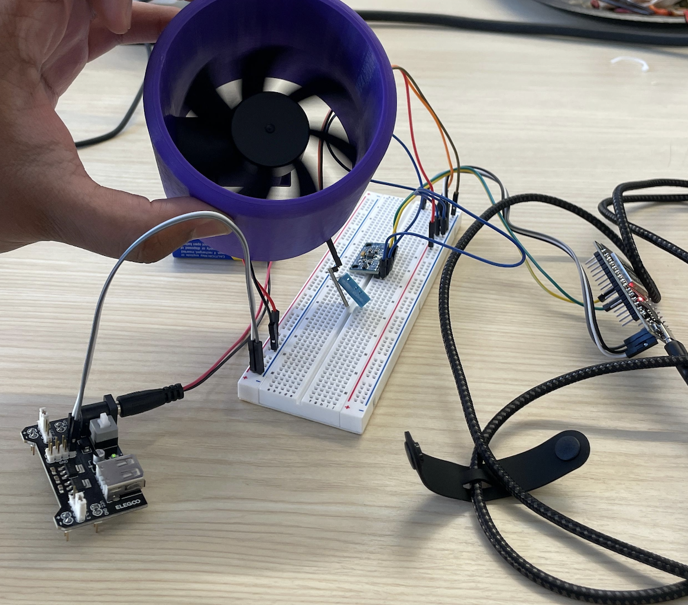

# IoT Engine Health Monitoring  
_Devil's Invent Hackathon Project_  

Predictive Maintenance – A connected IoT system that monitors **engine temperature, surrounding conditions, and vibration levels**. The system sends processed data to the cloud for **real-time visualization**, helping detect subtle anomalies and enabling predictive maintenance for improved reliability and reduced downtime.  

  

---

## Overview  
This project was developed during the **Honeywell Hackathon at Arizona State University** under the theme of designing **intelligent connected propulsion systems**.  

The idea was to modernize engine systems by integrating **smart sensors** with IoT connectivity. By tracking environmental and vibration parameters, the system allows operators to detect **early signs of wear and tear** and prepare maintenance resources in advance. This helps minimize unscheduled maintenance events, reduce downtime, and extend equipment lifecycle — ultimately improving fleet reliability while supporting sustainability goals.  

---

## Features  
- Continuous monitoring of **temperature, humidity, and heat index**  
- **Vibration analysis** using RMS and peak deviation values  
- Aggregated sampling for higher accuracy and noise reduction  
- Cloud upload at regular intervals (20s)  
- Real-time dashboard visualization for operators  

---

## System Architecture  
1. **Data Collection** – IoT controller reads values from environmental and vibration sensors.  
2. **Processing** – The controller aggregates vibration data (5s windows) to compute RMS and peak values.  
3. **Cloud Upload** – Every 20s, processed data is securely uploaded to a cloud platform.  
4. **Visualization** – A dashboard displays live charts for operators, showing trends in environmental and vibration data.  

---

## Applications  
- Engine health monitoring and anomaly detection  
- Predictive maintenance scheduling  
- Reducing unplanned downtime in fleets  
- Enhancing sustainability by extending equipment lifespan  
- Smart factories and IoT-driven monitoring systems  

---

## Prototype Implementation  
To replicate the industrial sensors and demonstrate the concept within the hackathon timeframe, we used the following components:  
- **ESP32 microcontroller** as the IoT controller  
- **Environmental sensor** (temperature & humidity) → simulated using DHT11  
- **Vibration/acceleration sensor** → simulated using MPU6050  
- **ThingSpeak cloud** for uploading and visualizing live data  

While these modules are hobby-grade sensors, they served as a **proof-of-concept** for what industrial-grade sensor suites would achieve in real-world engine monitoring systems.  

---

## Team  
Built by **Ishan Srivastava, Aadi Kadam, Aryan Shirodkar, Ian Cervantes, and Samridhi**  
Arizona State University  
**Devil's Invent Hackathon by Honeywell**  

---
